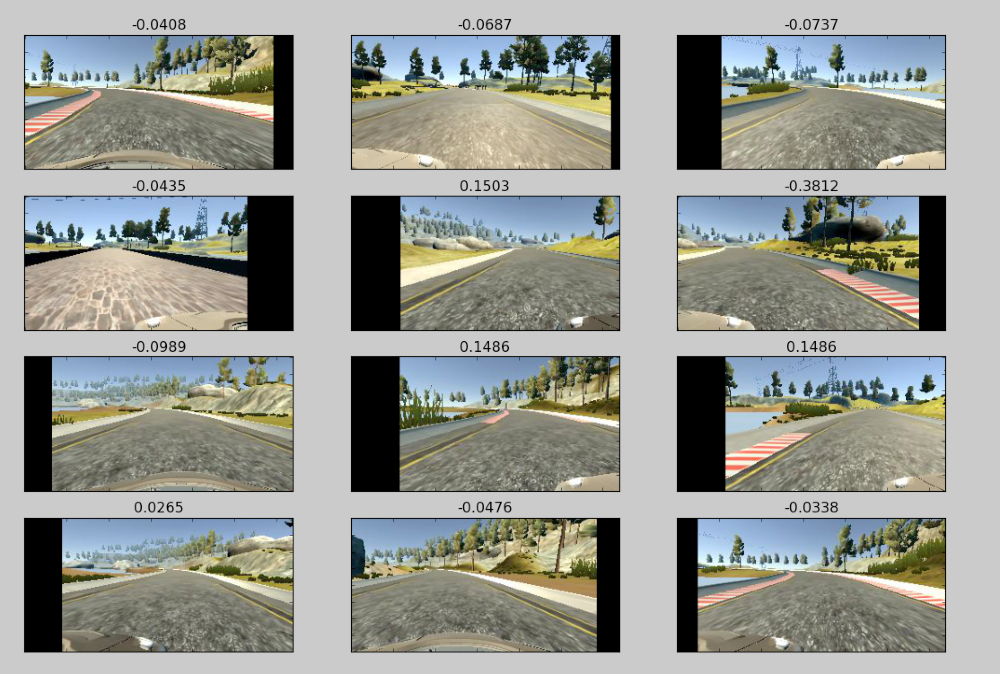
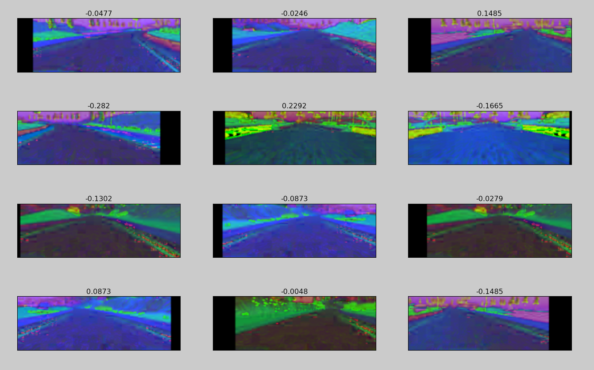

# Behavioral Cloning

## Objective
The objective of this project was to use Udacity's Self Driving Car simulator (https://github.com/udacity/self-driving-car-sim) to record training data, train a neural network, and then use that neural network to allow the car to complete a course it has never seen.  The data captured and used includes images taken from a dashboard camera in the simulated vehicle and the steering angle for each image. 

## Data Collection
A substantial amount of time was dedicated to gathering training data.  As a starting point, I used the training data set provided by Udacity.  This proved to be insufficient and additional training data had to be acquired.

In several parts of the track, the simulator was used to record the car correcting its position after it had gotten dangerously close to the edges of the track and returning back to the center of the lane.  This was done on straightaways as well as all of the turns on Track 1.

After the network had been trained and a few initial runs were performed, it became obvious parts of the track were still causing problems.  Perhpas most troublesome was the bridge on the track, the right turns immediately after the bridge, and the areas where the yellow lines were not present on both sides of the road.

On the bridge, the car would run into the sides.  This was most likely because the rails on the bridge looked different from the lanes throughout the rest of the track.  To overcome this, several passed across the bridge were recorded.  Some were of the car proceeding over the bridge, staying centered the entire times.  Other passes were done where the car was recorded moving back to the center of the bridge when it had veered to far to one side.  This same approach was used on the right turns after the bridge and the areas where there were not yellow lines on both sides of the track.

The total number of training images collected and used ended up being right at 100,000.  This number included the images captured from the left and right cameras as well.

## Augmentation

The data in the training set had a number of augmentations performed to it to generate more diverse and unique samples to train on.  A generator was used to load images from the training set and apply random augmentations.  The augmentations used are described below.

### Image Shifting/Translation

Each generated training image had a 40% chance of being shifted across the X-axis.  This was done to artificially generate turns outside of those that were recorded.  The image shift was selected at random and could be a shift of up to to 20% of the width of the image to the left or the right.  Each shift would also result in an adjustment to the expected steering angle.  The steering angle was adjusted based off of the number of pixels the image was shifted to the left or right.

A few example of images that have been shifted are shown below with there updated steering ranges.

### Brightness Adjustment

Each image used had a brightness adjustment made to it.  The brightness adjustment was made by converting the image from RGB to HSV and the adjusting the brightness by a scalar selected from a random uniform distribution ranging between 25% to 125% of its original brightness.  This range allowed intentionally favors decreasing brightness which was desirable since the training data was generated in broad daylight.

A few example of images that have had had thier brightness augmented are shown below.

### Image Flipping

Another method of augmentation was to flip/mirror recorded images and use the opposite steering direction for that image.  For example, if a training image for a left turn was recorded with an expected steering angle of -0.22, another image would be generated by flipping the original image so that it appeared as a right turn and the steering angle was changed to 0.22.

Samples of original images and and thier flipped counterparts are shown below with the expected steering angles.

## Preprocessing Data
Some preprocessing was performed on the augmented training data.  During preprocessing, each image was converted from the RGB colorspace to HSV.  Each image had the top and bottom cropped so that the backdrop/sky and the car's dashboard were not contained within the image.  Also, each image is resized to produce a 66x200 matrix. 

Below are some samples of images that have been augmented and undergone preprocessing with their steering angles shown. 

## Network Architecture
The architecture used for the neural network is nearly identical to the one desribed in a paper written by researchers at NVIDIA titled [End to End Learning for Self-Driving Cars](http://images.nvidia.com/content/tegra/automotive/images/2016/solutions/pdf/end-to-end-dl-using-px.pdf).

This architecture includes one layer for normalization, five convolutional layers for feature extraction, and 3 fully connected layers.  The output of the network is a single value representing the determined steering radius the car should take.

The five convolutional layers are described below:
* Convolutional Layer 1: Receives an image with dimensions of 66x200 and 3 input planes .  In this layer a 5x5 kernel is used with a stride of 2x2.  
* Convolutional Layer 2: Receives 24 input planes which are 31x98.  Again, a 5x5 kernel is used with 2x2 strides.
* Convolutional Layer 3: Receives 36 input planes which are 14x47.  Again, a 5x5 kernel is used with 2x2 strides.
* Convolutional Layer 4: Receives 48 input planes which are 5x22.  A 3x3 kernel is used with no striding.
* Convolutional Layer 5: Receives 64 input planes which are 3x20.  A 3x3 kernel is used with no striding.

Between each convolutional layer, an ELU activation is performed.  The last convolutional layer is then flattened into a connected layer containing 1164 neurons.  ELU activation is performed and the outputs of this layer are then fed into the next fully connected layer containing 100 neurons.  Again, ELU activation is performed and the outputs are passed into another layer of 50 neurons.  After ELU activation is performed, these outputs are passed to a final layer with 10 nuerons. A final ELU activation is performed and the results form up the output layer containing the determined value for the steering angle.

The Adam optimizer was used to train the network by minimizing the mean square error.

The final architecture looks like:

_Image above was taken from NVIDIA paper_

To avoid overfitting, I experimented with adding dropout layers between each of the fully connected layers.  This did not seem to have much of an effect on performance on track 2.  It also did not appear to help reduce validation loss by much while training.  This may be because all of the random augmentation helped prevent overfitting.  For this reason, it wasn't included in the final implementation.  _model_with_dropout.py_ was included to show how dropout layers were added and experimented with.

## Training

Only 5 epochs were needed to obtain a loss of less than 0.0100, which proved accurate enough to complete both tracks.  For each epoch, 40,000 different training samples were generated in batches of 256.  
 
## Validation and Testing
10% of the center camera images and their respective steering angles were designated for validation.  Niether these images nor any augmented version of these images were used in the training data.  From these validation images, validation samples were generated from the same generator used for generating training data.  This provided a useful indicator of how well the network would perform on data it had never seen.

For testing, no specific data set was designated.  Instead, the performance of how well the model performed on track 2, a track it had never seen data for before, was evaluated.

## Performance
After training and testing on track 1, the car was able to complete several laps around the track.  The car does tend to swerve left and right on straightaways.  This is likely due to the fact that images from the left/right camera were used and the steering correction for those cameras could still use a bit more tuning when augmenting the training images.

What was more impressive was how well testing went on track 2.  For whatever reason, it seemed that swerving wasn't as much of a problem on this track.  The only issue encountered on the first run was the steep hills.  It appeared that more acceleration would be needed to make it over the hills.  After some tweaking of the throttle in drive.py, it was able to make it all the way to the end of track 2 with no problems.

